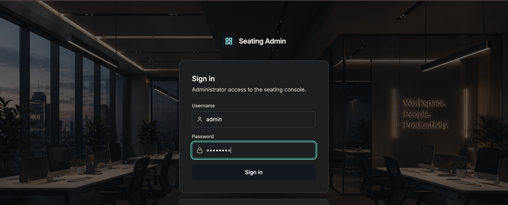
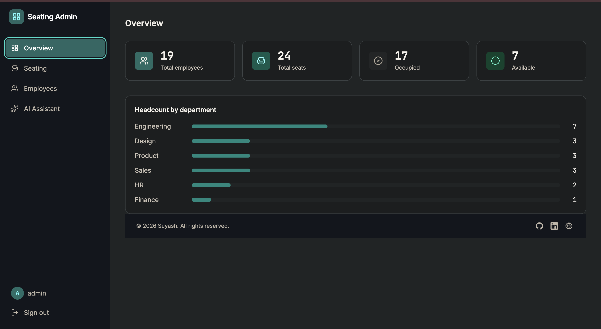
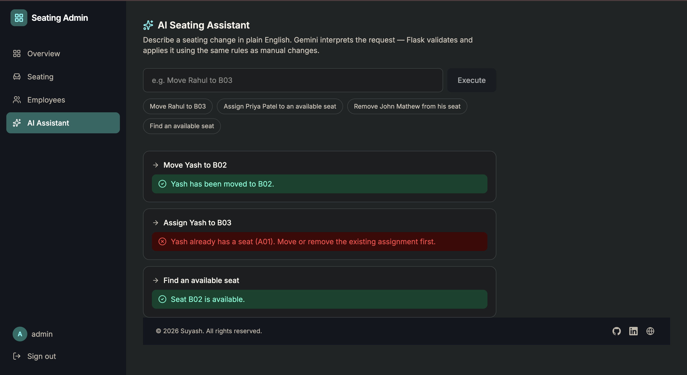
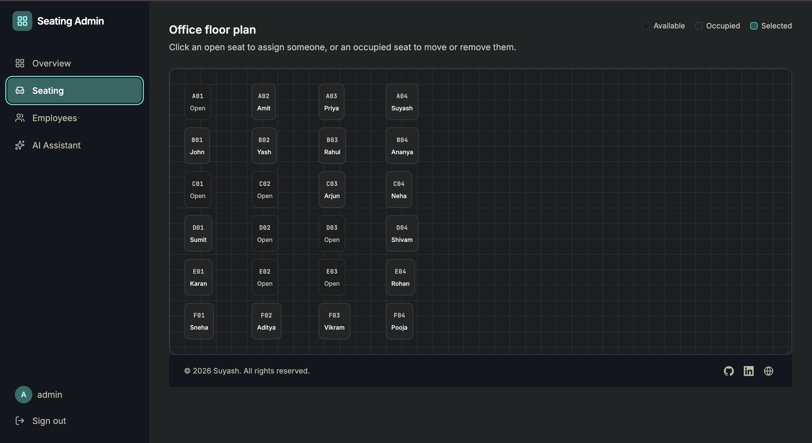

# Employee Seating Management System

An administrative console for viewing and managing office seat assignments, designed to demonstrate full-stack development, API design, database management, authentication, validation, and AI integration.

The application allows an administrator to manage employees and seating assignments through a React-based dashboard. It also includes a natural-language AI assistant powered by Gemini, allowing supported seating operations to be performed by typing requests instead of manually navigating through the interface.

Built for a technical assessment using a React + Vite frontend, Flask REST API backend, SQLite database, and Google Gemini for natural-language command interpretation.

---
**Live Url:** [View Live Application](https://employee-seating-management-production.up.railway.app)

**Repository:** [GitHub – Employee Seating Management System](https://github.com/suyashsingh7cse/employee-seating-management)

---
<p align="center">


</p>

---

## Overview

Employee Seating Management System is a full-stack web application for managing office employees, seats, and seat assignments.

Administrators can:

- View employee and seat occupancy statistics
- Manage employee records
- View the office seating layout
- Assign employees to available seats
- Move employees between seats
- Remove employees from seats
- Find available seats
- Use an AI assistant to perform supported seating operations with natural language
- Access protected functionality through administrator authentication

The application uses a React + Vite frontend, Flask backend, SQLite database, and Google Gemini for natural-language command interpretation.

---

## Features

### Dashboard

- Total employee count
- Total seat count
- Occupied seats
- Available seats
- Seating overview

### Employee Management

- List employees
- Create employees
- Update employee details
- Delete employees
- Search employees
- Validate required fields and email format
- Prevent duplicate email addresses

### Seating Management

- View all seats
- See occupied and available seats
- Assign an employee to a seat
- Move an employee to another seat
- Remove an assignment
- Prevent duplicate employee assignments
- Prevent assigning multiple employees to the same seat

### AI Assistant

The AI assistant supports natural-language commands such as:

```text
Move Rahul to B03
Assign Sumit to an available seat
Remove Priya Patel from his seat
Find an available seat
```

The AI is restricted to four supported actions:

```text
ASSIGN_EMPLOYEE
MOVE_EMPLOYEE
REMOVE_EMPLOYEE
FIND_AVAILABLE_SEAT
```

The AI interprets the command, but the backend remains responsible for validation and execution.

---

## Architecture

### Development

```text
React + Vite (:5173)
        |
        | /api/* proxy
        v
Flask REST API (:5001)
        |
        v
      SQLite
```

### Production

```text
Railway
  |
  +-- Single container
        |
        +-- Flask REST API (/api/*)
        +-- Compiled React frontend
        +-- SQLite database
        +-- Server-side Gemini API calls
```

In production, the React application is built and served by Flask as static files. This provides a single-origin deployment and keeps the Gemini API key on the server.

### AI Command Flow

```text
Administrator Command
        |
        v
POST /api/ai/command
        |
        v
Gemini interprets the request
        |
        v
One supported structured action
        |
        v
Flask validates the action
        |
        v
Existing business rules are applied
        |
        v
SQLite is updated only if validation succeeds
        |
        v
React refreshes the displayed data
```

The AI is an interpreter, not an authority over the database.

---

## Technology Stack

| Technology | Purpose |
|---|---|
| React | Frontend UI |
| Vite | Frontend development and build tooling |
| Tailwind CSS | Styling |
| Lucide React | Icons |
| Python | Backend development |
| Flask | REST API and application server |
| SQLite | Application database |
| SQLAlchemy | Database ORM |
| Google Gemini | Natural-language command interpretation |
| Pytest | Backend testing |
| Docker | Containerization |
| Gunicorn | Production WSGI server |
| Railway | Deployment configuration |

---

## Database Design

The application uses three primary entities:

```text
Employee                    Seat                    SeatAssignment
--------                    ----                    --------------
id                          id                      id
name                        seat_number (unique)    employee_id (FK, unique)
email (unique)              row                     seat_id (FK, unique)
department                  column                  assigned_at
created_at
```

Database constraints ensure that an employee can have at most one active seat assignment and a seat can have at most one assigned employee.

Deleting an employee also removes the employee's seat assignment, freeing the associated seat.

The project seeds 24 seats across rows A–F, with four seats per row.

---

## Security and Validation

The application includes:

- Protected application routes requiring an authenticated administrator session
- Flask signed cookie sessions
- `HttpOnly` session cookies
- `SameSite=Lax` session cookies
- `Secure` cookies in production
- Environment-based secrets and credentials
- Constant-time credential comparison with `secrets.compare_digest`
- Employee field and email validation
- Duplicate employee/seat assignment prevention
- AI action whitelisting
- AI output validation before database operations
- Request body size limits
- Backend-only Gemini API key storage

### AI Validation Model

Gemini may return one of these action shapes:

```json
{"action": "ASSIGN_EMPLOYEE", "employee_name": "...", "seat_number": "..."}
```

```json
{"action": "MOVE_EMPLOYEE", "employee_name": "...", "seat_number": "..."}
```

```json
{"action": "REMOVE_EMPLOYEE", "employee_name": "..."}
```

```json
{"action": "FIND_AVAILABLE_SEAT"}
```

Anything outside the supported action set is rejected. AI-originated requests use the same validation functions as manual seating operations.

---

## API Reference

All routes return JSON. Except for authentication endpoints and the health endpoint, API routes require an authenticated administrator session.

### Authentication

| Method | Path | Description |
|---|---|---|
| `POST` | `/api/auth/login` | Starts an authenticated session |
| `POST` | `/api/auth/logout` | Clears the session |
| `GET` | `/api/auth/me` | Returns the current authenticated administrator |

### Employees

| Method | Path | Description |
|---|---|---|
| `GET` | `/api/employees?search=` | Lists employees with optional search |
| `POST` | `/api/employees` | Creates an employee |
| `GET` | `/api/employees/:id` | Gets an employee |
| `PUT` | `/api/employees/:id` | Updates an employee |
| `DELETE` | `/api/employees/:id` | Deletes an employee and frees their seat |

### Seats

| Method | Path | Description |
|---|---|---|
| `GET` | `/api/seats` | Lists seats and occupancy information |

### Assignments

| Method | Path | Description |
|---|---|---|
| `GET` | `/api/assignments` | Lists active assignments |
| `POST` | `/api/assignments` | Creates a seat assignment |
| `PUT` | `/api/assignments/:id` | Moves an assignment |
| `DELETE` | `/api/assignments/:id` | Removes an assignment |

### AI

| Method | Path | Description |
|---|---|---|
| `POST` | `/api/ai/command` | Interprets and executes a supported seating command |

Example request:

```json
{
  "command": "Move Rahul to B03"
}
```

Errors use:

```json
{
  "error": "Human-readable message"
}
```

---

## Project Structure

```text
employee-seating-management/
├── Dockerfile
├── docker-compose.yml
├── railway.json
├── LICENSE
├── README.md
├── backend/
│   ├── app/
│   │   ├── __init__.py
│   │   ├── config.py
│   │   ├── models.py
│   │   ├── routes/
│   │   │   ├── auth.py
│   │   │   ├── employees.py
│   │   │   ├── seats.py
│   │   │   ├── assignments.py
│   │   │   └── ai.py
│   │   ├── services/
│   │   │   └── ai_service.py
│   │   └── utils/
│   │       ├── validation.py
│   │       └── auth_helpers.py
│   ├── tests/
│   ├── seed.py
│   ├── run.py
│   ├── requirements.txt
│   ├── Dockerfile
│   └── .env.example
├── screenshots/
│
└── frontend/
    ├── src/
    │   ├── components/
    │   ├── pages/
    │   ├── hooks/
    │   ├── services/
    │   ├── App.jsx
    │   └── main.jsx
    ├── package.json
    ├── vite.config.js
    └── Dockerfile
```

---

## Getting Started

### Prerequisites

- Python 3.10+
- Node.js 18+
- npm
- Git
- A Google Gemini API key

### Clone the Repository

```bash
git clone https://github.com/suyashsingh7cse/employee-seating-management.git
cd employee-seating-management
```

---

## Backend Setup

```bash
cd backend
python3 -m venv .venv
source .venv/bin/activate
pip install -r requirements.txt
cp .env.example .env
```

For Windows activation:

```bash
.venv\Scripts\activate
```

Configure `backend/.env`:

```env
FLASK_SECRET_KEY=your-random-secret-key
FLASK_ENV=development

ADMIN_USERNAME=admin
ADMIN_PASSWORD=admin123

DATABASE_PATH=instance/seating.db

GEMINI_API_KEY=your_gemini_api_key
GEMINI_MODEL=gemini-3.1-flash-lite
```
Seed the database:

```bash
python seed.py
```

Start the backend:

```bash
python run.py
```

The backend API runs on port `5001`.

---

## Frontend Setup

Open a second terminal:

```bash
cd frontend
npm install
npm run dev
```

Open:

```text
http://localhost:5173
```

The Vite development server proxies `/api/*` requests to the Flask backend.

---

## Demo Credentials

For local evaluation and demonstration:

```text
Username: admin
Password: admin123
```

Use different secure credentials in production through environment variables.

---

## Docker

Copy and configure the environment file:

```bash
cp backend/.env.example backend/.env
```

Run:

```bash
docker compose up --build
```

Development services:

- Frontend: `http://localhost:5173`
- Backend API: `http://localhost:5001`

---

## Testing

Run the backend tests:

```bash
cd backend
source .venv/bin/activate
pytest -v
```

The test suite covers:

- Login and session behavior
- Employee CRUD and validation
- Seat listing
- Assignment creation, movement, and removal
- Duplicate employee/seat prevention
- Invalid employee and seat handling
- Cascade deletion
- All four supported AI actions
- Unsupported AI actions
- Prompt-injection scenarios
- Upstream AI failures

Verified project status:

```text
40/40 backend tests passing
```

---

## Production Build

Build the frontend:

```bash
cd frontend
npm run build
```

The production build is served by Flask in the root production container.

---

## Railway Deployment

The project includes `railway.json` and a root production `Dockerfile`.

### Deployment Steps

1. Push the repository to GitHub.
2. Create a Railway project.
3. Select **Deploy from GitHub Repository**.
4. Select this repository.
5. Add a persistent volume mounted at:

```text
/app/instance
```

6. Configure:

| Variable | Value |
|---|---|
| `FLASK_SECRET_KEY` | A long random production secret |
| `FLASK_ENV` | `production` |
| `ADMIN_USERNAME` | Your production username |
| `ADMIN_PASSWORD` | Your secure production password |
| `DATABASE_PATH` | `/app/instance/seating.db` |
| `GEMINI_API_KEY` | Your Gemini API key |
| `GEMINI_MODEL` | `gemini-3.1-flash-lite` |

Railway provides the `PORT` environment variable automatically.

### Verify Deployment

1. Open the generated Railway URL.
2. Confirm the login page loads.
3. Log in with the configured credentials.
4. Check the dashboard, employee list, and seating layout.
5. Test an AI command.

---

## Screenshots

| Login | Dashboard |
|---|---|
|  |  |

| AI Assistant | Seating Management |
|---|---|
|  |  |
---

## Future Improvements

- Role-based access control
- Multiple administrator accounts
- PostgreSQL for larger production deployments
- Audit logs
- Advanced employee filtering
- Interactive floor-plan visualization
- Seating analytics
- AI conversation history
- Multi-office support

---

## License

This project is licensed under the MIT License. See the [LICENSE](LICENSE) file for details.

---

## Author

**Suyash Singh**

Computer Science and Engineering Student  
Interested in Software Development, Cloud Computing, Full-Stack Development, and AI-powered applications.

<p>
  <a href="https://github.com/suyashsingh7cse">
    
  </a>
  <a href="https://www.linkedin.com/in/suyash-020a321a8/">
    
  </a>
  <a href="https://suyash-singh.vercel.app/">
    
  </a>
</p>

<p align="center">
  Built with ❤️ by <a href="https://github.com/suyashsingh7cse">Suyash Singh</a>
</p>
